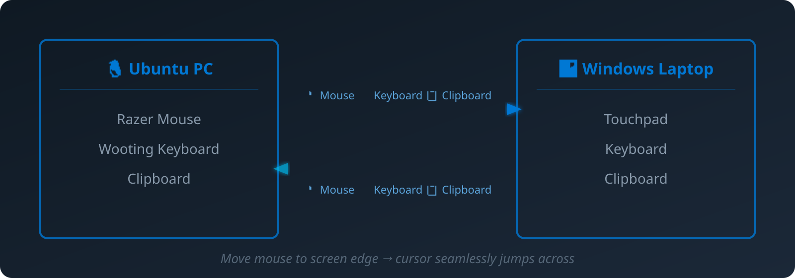

<p align="center">
  
</p>

<p align="center">
  Share your keyboard, mouse, and clipboard seamlessly between Linux and Windows.
</p>

<p align="center">
  <a href="#features">Features</a> &bull;
  <a href="#installation">Installation</a> &bull;
  <a href="#quick-start">Quick Start</a> &bull;
  <a href="#how-it-works">How It Works</a> &bull;
  <a href="#configuration">Configuration</a> &bull;
  <a href="#contributing">Contributing</a>
</p>

<p align="center">
  
  
  
  
</p>

---

## What is this?

MWB Linux is a native Linux client that connects to **Microsoft PowerToys Mouse Without Borders** on Windows. Move your mouse to the edge of the screen, and it seamlessly jumps to the other machine — along with your keyboard and clipboard.

<p align="center">
  
</p>

No extra software needed on Windows — just PowerToys, which is already installed on millions of machines.

## Features

- **Bidirectional mouse sharing** — Control both machines from either keyboard/mouse
- **Seamless edge switching** — Move cursor to screen edge, it appears on the other machine
- **Clipboard sync** — Copy text or images on one machine, paste on the other
- **Keyboard forwarding** — Type on your Linux keyboard, text appears on Windows
- **Encrypted** — AES-256-CBC encryption with PBKDF2 key derivation
- **Device isolation** — When controlling Windows, your Linux cursor doesn't move
- **Zero config on Windows** — Works with existing PowerToys MWB setup
- **Lightweight** — Single binary, ~5MB, no GUI dependencies

## Demo

| Direction | What happens |
|-----------|-------------|
| Mouse hits left edge on Linux | Cursor appears on Windows, Linux input disabled |
| Mouse hits right edge on Windows | Cursor returns to Linux, input restored |
| Ctrl+C on Windows | Text/image available on Linux clipboard |
| Ctrl+C on Linux | Text/image available on Windows clipboard |
| Type on Linux keyboard | Text appears in focused Windows app |

## Installation

### Prerequisites

```bash
sudo apt install xdotool xinput xclip xrandr
```

### From Source

```bash
git clone https://github.com/lucky-verma/mwb-linux.git
cd mwb-linux
make build
sudo make install
```

### From Release

Download the latest `.deb` package from [Releases](https://github.com/lucky-verma/mwb-linux/releases):

```bash
sudo dpkg -i mwb-linux_*.deb
```

### Setup Permissions

```bash
# Load uinput module
sudo modprobe uinput
echo 'uinput' | sudo tee /etc/modules-load.d/uinput.conf

# Set device permissions
echo 'KERNEL=="uinput", GROUP="input", MODE="0660"' | sudo tee /etc/udev/rules.d/99-uinput.rules
sudo udevadm control --reload-rules && sudo udevadm trigger /dev/uinput

# Add your user to the input group
sudo usermod -aG input $USER

# Log out and back in for group changes to take effect
```

## Quick Start

### 1. Get the security key from Windows

Open **PowerToys** → **Mouse Without Borders** → copy the **Security Key**.

### 2. Configure

```bash
mkdir -p ~/.config/mwb
cat > ~/.config/mwb/config.toml << EOF
host = "192.168.1.100"        # Your Windows machine's IP
key = "YourSecurityKey"       # From PowerToys MWB
name = "linux"                # This machine's name (max 15 chars)
EOF
```

### 3. Run

```bash
# Receive only (Windows controls Linux)
mwb

# Bidirectional (Linux also controls Windows)
sudo mwb -bidi -edge left
```

### 4. Add your Linux machine on Windows

In PowerToys MWB, enter the security key and device name to connect.

## How It Works

MWB Linux implements the full Mouse Without Borders protocol:

1. **Connection** — TCP to port 15101 with AES-256-CBC encryption
2. **Handshake** — Challenge-response authentication using PBKDF2-SHA512
3. **Input sharing** — Mouse/keyboard events encoded as MWB packets
4. **Edge detection** — Cursor position polling detects screen edges
5. **Device isolation** — `xinput disable/enable` prevents dual cursor movement
6. **Clipboard** — Text/images compressed and sent in 48-byte chunks

For detailed protocol documentation, see [docs/ARCHITECTURE.md](docs/ARCHITECTURE.md).

## Configuration

### config.toml

| Field | Default | Description |
|-------|---------|-------------|
| `host` | (required) | Windows machine IP address |
| `key` | (required) | MWB security key (from PowerToys) |
| `name` | hostname | This machine's display name |
| `port` | 15100 | Base port (message port = 15101) |

### CLI Flags

| Flag | Default | Description |
|------|---------|-------------|
| `-bidi` | false | Enable bidirectional input (Linux → Windows) |
| `-edge` | right | Screen edge for switching: `left` or `right` |
| `-debug` | false | Enable debug logging |
| `-config` | ~/.config/mwb/config.toml | Config file path |

### Windows Side Requirements

- **PowerToys** installed with Mouse Without Borders enabled
- **"Move mouse relatively"** set to **OFF** (for bidirectional mode)
- Security key shared with Linux client

## Troubleshooting

### "permission denied" on /dev/uinput
Run the setup permissions commands above, then log out and back in.

### Clipboard not syncing
Ensure `xclip` is installed: `sudo apt install xclip`

### Mouse controls both screens simultaneously
Run with `-bidi` flag and `sudo` for device isolation via xinput.

### Connection refused
- Check Windows firewall allows port 15100-15101
- Verify the IP address in config.toml
- Ensure PowerToys MWB is enabled on Windows

### Cursor bounces back immediately
Set "Move mouse relatively" to OFF in PowerToys MWB settings.

## Project Structure

```
cmd/mwb/              CLI entry point
internal/
  capture/            Edge detection, evdev capture, xinput device isolation
  clipboard/          Bidirectional clipboard sync (text + images)
  config/             TOML configuration
  input/              Virtual mouse/keyboard via uinput
  network/            TCP connection, encryption, packet send/receive
  protocol/           MWB packet types, serialization, AES-256-CBC
docs/
  ARCHITECTURE.md     Detailed protocol and architecture documentation
scripts/
  install.sh          Installation helper script
```

## Contributing

Contributions are welcome! Please see [CONTRIBUTING.md](CONTRIBUTING.md) for guidelines.

### Building

```bash
make build    # Build binary
make test     # Run tests
make lint     # Run linter
make check    # All of the above
```

## Acknowledgments

- [Microsoft PowerToys](https://github.com/microsoft/PowerToys) — Mouse Without Borders is part of PowerToys (MIT License). This project implements the MWB network protocol for Linux.
- [bketelsen/mwb](https://github.com/bketelsen/mwb) — Initial Go implementation of the MWB receive-only client that this project builds upon.
- The MWB protocol specification was derived from the open-source PowerToys codebase.

## License

MIT License — see [LICENSE](LICENSE) for details.
