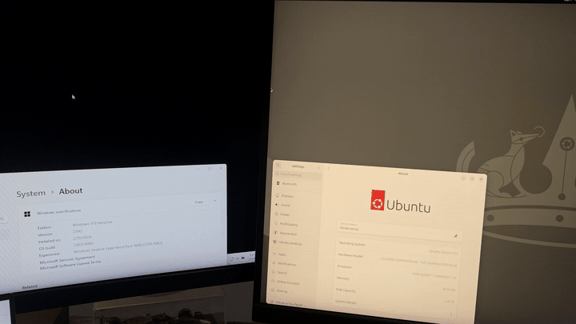

<p align="center">
  
</p>

<p align="center">
  Share your keyboard, mouse, and clipboard seamlessly between Linux and Windows.
</p>

<p align="center">
  <a href="#features">Features</a> &bull;
  <a href="#installation">Installation</a> &bull;
  <a href="#quick-start">Quick Start</a> &bull;
  <a href="#how-it-works">How It Works</a> &bull;
  <a href="#configuration">Configuration</a> &bull;
  <a href="#contributing">Contributing</a>
</p>

<p align="center">
  
  
  
  
</p>

---

## What is this?

MWB Linux is a native Linux client that connects to **Microsoft PowerToys Mouse Without Borders** on Windows. Move your mouse to the edge of the screen, and it seamlessly jumps to the other machine — along with your keyboard and clipboard.


```mermaid
flowchart LR
    A["🐧 <b>Linux PC</b><br/>Mouse · Keyboard"] <-->|" 🖱️ Mouse · ⌨️ Keyboard · 📋 Clipboard "| B["🪟 <b>Windows PC</b><br/>Mouse · Keyboard"]
```

> Move your mouse to the screen edge — the cursor seamlessly jumps to the other machine.

No extra software needed on Windows beyond PowerToys, which bundles Mouse Without Borders.

## Features

- **Bidirectional mouse sharing** — Control both machines from either keyboard/mouse
- **Seamless edge switching** — Move cursor to screen edge, it appears on the other machine
- **Clipboard sync** — Copy text or images on one machine, paste on the other
- **Keyboard forwarding** — Type on your Linux keyboard, text appears on Windows
- **Full mouse support** — Scroll wheel, horizontal scroll, and side buttons (back/forward)
- **Encrypted** — AES-256-CBC encryption with PBKDF2 key derivation
- **Device isolation** — When controlling Windows, your Linux cursor doesn't move
- **Dual-mode connection** — Acts as both server and client for fast reconnection
- **Zero config on Windows** — Works with existing PowerToys MWB setup
- **Lightweight** — Single binary, ~5MB, no GUI dependencies

## Demo

| Direction | What happens |
|-----------|-------------|
| Mouse hits left edge on Linux | Cursor appears on Windows, Linux input disabled |
| Mouse hits right edge on Windows | Cursor returns to Linux, input restored |
| Ctrl+C on Windows | Text/image available on Linux clipboard |
| Ctrl+C on Linux | Text/image available on Windows clipboard |
| Type on Linux keyboard | Text appears in focused Windows app |

## Installation

### One-Line Install (Ubuntu/Debian)

```bash
curl -fsSL https://raw.githubusercontent.com/lucky-verma/mwb-linux/main/scripts/install.sh | sudo bash
```

### From .deb Package

Download the versioned `.deb` for your architecture from
[Releases](https://github.com/lucky-verma/mwb-linux/releases), then install it:

```bash
sudo dpkg -i mwb-linux_*_amd64.deb

# Add yourself to the input group
sudo usermod -aG input $USER
```

### From Binary

```bash
# Download binary
wget https://github.com/lucky-verma/mwb-linux/releases/latest/download/mwb-linux-amd64
chmod +x mwb-linux-amd64
sudo mv mwb-linux-amd64 /usr/local/bin/mwb

# Install dependencies
sudo apt install xdotool xclip

# Setup permissions
sudo bash -c 'modprobe uinput && echo uinput > /etc/modules-load.d/uinput.conf'
echo 'KERNEL=="uinput", GROUP="input", MODE="0660"' | sudo tee /etc/udev/rules.d/99-mwb-uinput.rules
sudo udevadm control --reload-rules
sudo usermod -aG input $USER
```

### With Go

```bash
go install github.com/lucky-verma/mwb-linux/cmd/mwb@latest
```

Puts `mwb` in `$(go env GOPATH)/bin`. You still need the system dependencies and
permissions from [From Binary](#from-binary): `xdotool`/`xclip`, the `uinput`
module, the udev rule, and membership of the `input` group. This build reports
`dev` for `mwb version`, since the release ldflags are not applied.

### From Source

```bash
git clone https://github.com/lucky-verma/mwb-linux.git
cd mwb-linux
make build
make install        # no sudo — installs a per-user service
systemctl --user enable --now mwb
```

`make install` is a per-user install: the binary goes to `~/go/bin/mwb` and the
service to `~/.config/systemd/user/`. Do **not** run it with `sudo` — that
installs under `root` and the `--user` service then can't find the binary.

The installed service runs receive-only mode (`mwb`) so it will not
unexpectedly send the Linux mouse to Windows. Use `mwb -bidi -edge left`
manually when you explicitly want Linux → Windows control.

It does not set up system dependencies. If this is a fresh machine, run the
dependency and permission steps from [From Binary](#from-binary) first
(`xdotool`/`xclip`, the `uinput` module, the udev rule, and the
`input` group).

> **Note:** Log out and back in after installation for group changes to take effect.
>
> **One installer at a time.** The one-line/`.deb`/binary methods install a
> system service that runs `/usr/local/bin/mwb`. `make install` installs a
> per-user service that runs `~/go/bin/mwb`. If you switch methods, stop and
> disable the old service first so you aren't running a stale binary.

## Updating

```bash
mwb update --check   # see what's available
mwb update           # download, verify and install
```

`mwb update` fetches the release artifact for your architecture, verifies it
against the SHA-256 published in that release's `checksums.txt`, and replaces
the binary atomically — an interrupted update leaves either the old binary or
the new one, never a broken one. It refuses to install anything whose checksum
does not match, and only ever downloads from GitHub.

If mwb was installed from the `.deb`, `mwb update` will not overwrite it behind
dpkg's back; it prints the `apt` command to use instead. If the binary lives
somewhere only root can write, it tells you to re-run with `sudo`.

The running service keeps using the old binary until it is restarted:

```bash
systemctl --user restart mwb.service
```

## Quick Start

### 1. Get the security key from Windows

Open **PowerToys** → **Mouse Without Borders** → copy the **Security Key**.

### 2. Configure

```bash
mkdir -p ~/.config/mwb
cat > ~/.config/mwb/config.toml << EOF
host = "192.168.1.100"        # Your Windows machine's IP
key = "YourSecurityKey"       # From PowerToys MWB
name = "linux"                # This machine's name (max 15 chars)
keyboard_layout = "auto"      # Inbound keyboard layout profile
EOF
```

### 3. Run

```bash
# Receive only (Windows controls Linux)
mwb

# Bidirectional (Linux also controls Windows)
mwb -bidi -edge left
```

### 4. Add your Linux machine on Windows

In PowerToys MWB, enter the security key and device name to connect.

## How It Works

MWB Linux implements the full Mouse Without Borders protocol:

1. **Dual-mode connection** — Listens on port 15101 AND connects outbound (first one wins)
2. **Handshake** — AES-256-CBC encrypted challenge-response with PBKDF2-SHA512 key derivation
3. **Heartbeats** — Proactive keepalive every 5s prevents Windows from dropping the connection
4. **Edge detection** — 10ms cursor polling detects screen edges, instant switching with bounce prevention
5. **Input forwarding** — Mouse (absolute coords) and keyboard (VK codes) sent as MWB packets
6. **Device isolation** — exclusive `EVIOCGRAB` kernel grabs on local keyboards and pointers prevent dual cursor movement during remote control. The grab is owned by the file descriptor, so the kernel restores local input automatically if mwb exits, crashes or is killed
7. **Clipboard** — Bidirectional text/image sync via compressed clipboard packets
8. **File copy** — Copy one file, switch to the other machine, and paste it into the folder you choose. In both directions the receiver stages the file privately on its clipboard; a copy alone never creates a visible destination file. Bytes travel over a second connection on the clipboard port (base; control is base+1), matching PowerToys MWB

For detailed protocol documentation, see [docs/ARCHITECTURE.md](docs/ARCHITECTURE.md).

## Security

Mouse Without Borders lets a remote machine inject keyboard and mouse input into
your Linux session, so treat it like remote control and run it only on networks
and machines you trust.

- **Local networks only.** As defense in depth, the client refuses inbound
  connections from globally routable addresses before they can consume any
  handshake work; the internet cannot reach the handshake. Sources on a local
  network (RFC1918/ULA private space or an IPv6 link-local address) are allowed
  to attempt it, because the configured peer is a machine rather than an
  address: a dual-stack Windows host connects from an IPv6 link-local address
  that no lookup of its IPv4 will return, and DHCP renewal, a second NIC or a
  VPN route all change the source address without changing the peer. This
  widens who may *attempt* authentication, never who passes it. The outbound
  connection is unchanged.
- **Shared secret.** Use a long, random `key` and protect the config file.
  Anyone who obtains the key and can reach the configured host can impersonate
  an MWB peer.
- **Firewall.** Only expose ports **15100–15101** to your trusted LAN. Block them
  from the internet, and avoid using the client on untrusted/public Wi-Fi.
- **No sudo.** Run as your normal user (in the `input` group); `sudo mwb` can
  attach to the wrong session and is unnecessary.

For compatibility, the transport uses the original MWB AES-256-CBC protocol
rather than a modern authenticated-encryption protocol. Treat the peer-IP check
as an additional network boundary, not as a replacement for the shared key, and
keep the client on a trusted network segment.

## Configuration

### config.toml

| Field | Default | Description |
|-------|---------|-------------|
| `host` | (required) | Windows machine IP address |
| `key` | (required) | MWB security key (from PowerToys) |
| `name` | hostname | This machine's display name |
| `port` | 15100 | Base port (message port = 15101) |
| `remote_width` | 1920 | Remote screen width in pixels |
| `remote_height` | 1080 | Remote screen height in pixels |
| `edge` | left | Screen edge for switching: `left` or `right` |
| `clipboard` | true | Clipboard sync: set `false` to disable text/image sharing |
| `accel_multiplier` | 2.0 | Cursor speed when controlling Windows. Lower it (e.g. `1.0`, `0.5`) if the Windows cursor feels too fast |
| `inbound_multiplier` | 1.0 | Cursor speed when Windows controls Linux. `1.0` mirrors Windows exactly; raise it for faster inbound movement |
| `file_transfer` | true | Enable the MWB file copy channel. Keep `clipboard = true`: clipboard events trigger transfers in both directions |
| `file_dir` | — | Deprecated and ignored. Windows files use hidden clipboard backing storage under `$XDG_CACHE_HOME/mwb/clipboard` and a native GNOME/generic file selection, then appear in a visible folder only on paste |
| `max_file_size` | 104857600 | Per-transfer cap in bytes. The default matches MWB's own 100 MB limit; a stock Windows peer neither sends nor accepts more |
| `keyboard_layout` | auto | Inbound Windows-to-Linux keyboard mapping. `auto` detects the local Linux layout when possible; supported profiles include `us`, `de`, `fr`, `be`, `es`, `it`, `gb`, `pt`, `no`/`dk`/`se`/`fi`, `ch`, and `nl` |

> **Config file security:** `config.toml` stores the security key in plaintext.
> The installer creates it with `0600` permissions (owner-only), and `mwb`
> tightens an existing config to `0600` on startup so other local accounts can't
> read the key. Use a long, random key — `mwb` logs a warning if the configured
> key is very short.

### Commands

| Command | Description |
|---------|-------------|
| `mwb` | Run the client (default when no command is given) |
| `mwb version` | Print the installed version |
| `mwb update` | Download and install the latest release |
| `mwb update --check` | Report whether an update exists, without installing |
| `mwb update --force` | Reinstall the latest release even if already current |

### CLI Flags

| Flag | Default | Description |
|------|---------|-------------|
| `-bidi` | false | Enable bidirectional input (Linux → Windows) |
| `-edge` | *(from config)* | Override edge from config: `left` or `right` |
| `-no-clipboard` | false | Disable clipboard sharing (overrides config) |
| `-debug` | false | Enable debug logging |
| `-config` | ~/.config/mwb/config.toml | Config file path |

### Windows Side Requirements

- **PowerToys** installed with Mouse Without Borders enabled
- **"Move mouse relatively"** set to **OFF** (required for bidirectional mode)
- **"Share clipboard"** set to **ON** (for clipboard sync)
- **"Block screen saver on other machines"** set to **ON** (recommended, keeps connection alive)
- Security key shared with Linux client
- Windows Firewall must allow ports **15100-15101** (TCP inbound/outbound)

## Troubleshooting

### "permission denied" on /dev/uinput
Run the setup permissions commands above, then log out and back in.

### Clipboard not syncing
Ensure `xclip` is installed: `sudo apt install xclip`

### Disable clipboard sharing
Set `clipboard = false` in `config.toml`, or run with `-no-clipboard`. The Linux
client then never reads or writes the local clipboard, so it won't override what
you copied on Windows.

### Mouse controls both screens simultaneously
Make sure you are running bidirectional mode with `mwb -bidi -edge left` after
the udev/input-group setup and a fresh login. Avoid `sudo mwb` for normal use:
it reads root's config and can miss the user's display/session.

If an older root service is still running, stop it before starting the user
service:

```bash
sudo systemctl disable --now mwb-linux.service
systemctl --user restart mwb
```

### Connection refused
- Check Windows firewall allows port 15100-15101
- Verify the IP address in config.toml
- Ensure PowerToys MWB is enabled on Windows

### Cursor bounces back immediately
Set "Move mouse relatively" to OFF in PowerToys MWB settings.

### Cursor returns from the far edge of the other laptop
Upgrade to a build with directional `MachineSwitched`/`NextMachine` filtering.
The Linux client should only accept return requests from the edge configured by
`-edge`; touching the other laptop's far edge should stop there, not bring
control back to Ubuntu.

## Project Structure

```
cmd/mwb/              CLI entry point
internal/
  capture/            Edge detection, evdev capture, EVIOCGRAB device isolation
  clipboard/          Bidirectional clipboard sync (text + images)
  config/             TOML configuration
  input/              Virtual mouse/keyboard via uinput
  network/            TCP connection, encryption, packet send/receive
  protocol/           MWB packet types, serialization, AES-256-CBC
docs/
  ARCHITECTURE.md     Detailed protocol and architecture documentation
scripts/
  install.sh          Installation helper script
```

## Known Limitations

- **Keyboard on Windows lock screen** — Keyboard input may not work on the Windows lock screen (Winlogon desktop security restriction)
- **Middle mouse button auto-scroll** — Middle-click auto-scroll (scroll lock mode) does not work in browsers; normal middle-click works
- **First connection** — Initial handshake takes ~3-16s depending on Windows MWB state; subsequent reconnects are instant
- **Bidirectional mode requires X11** — Edge detection uses `xdotool`. (Device isolation itself is display-server agnostic: `EVIOCGRAB` works identically on X11, Wayland and the console.) Receive-only mode works on Wayland (XWayland session). Native Wayland bidirectional support requires compositor extensions and is not yet implemented.
- **Keyboard layout metadata** — PowerToys MWB keyboard packets carry Windows virtual-key codes and flags, but not hardware scan codes or Unicode text. MWB Linux uses `keyboard_layout` profiles for common layouts; unsupported profiles fall back to the original US-compatible mapping. Fully zero-config global layout support requires sender-side scan code or Unicode metadata.
- **File copy is one file at a time** — Matching MWB itself, folders and
  multi-file selections are not transferred; zip them first. The 100 MB default
  cap is MWB's own limit, not ours. Drag-and-drop between machines is not
  supported: that flow needs Explorer `DragEnter` and helper windows, so it is
  Windows-only by construction.
- **Special-function keys stay local while remote** — Media, brightness and
  similar hardware keys are deliberately not grabbed, so they act on the Linux
  machine even while the cursor is on the remote. Power and sleep buttons are
  likewise never grabbed, which keeps the physical power button available as a
  last-resort recovery path.
- **Cursor speed / drift** — Remote cursor movement scales raw evdev deltas by `accel_multiplier` (default 2×); lower it if the Windows cursor feels too fast (the Windows side adds no acceleration of its own). Tracking is open-loop, so the virtual cursor may still drift from the actual position over long sessions.

## Contributing

Contributions are welcome! Please see [CONTRIBUTING.md](CONTRIBUTING.md) for guidelines.

### Building

```bash
make build    # Build binary
make test     # Run tests
make lint     # Run linter
make check    # All of the above
```

## Acknowledgments

- [Microsoft PowerToys](https://github.com/microsoft/PowerToys) — Mouse Without Borders is part of PowerToys (MIT License). This project implements the MWB network protocol for Linux.
- [bketelsen/mwb](https://github.com/bketelsen/mwb) — Initial Go implementation of the MWB receive-only client that this project builds upon.
- The MWB protocol specification was derived from the open-source PowerToys codebase.

## License

MIT License — see [LICENSE](LICENSE) for details.
