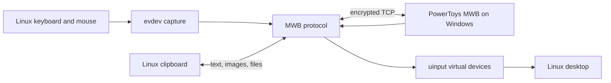

# Architecture

MWB Linux is a native Linux client for Microsoft PowerToys Mouse Without
Borders. It can receive input from Windows and, in bidirectional mode, send
Linux input back to Windows.

## Runtime overview

The process has four main jobs:

1. Maintain an encrypted MWB connection with the configured Windows machine.
2. Inject incoming keyboard and mouse packets through Linux `uinput` devices.
3. In bidirectional mode, detect the configured screen edge, capture local
   `evdev` events, and forward them to Windows.
4. Synchronize clipboard text, images, and supported file selections.

## Connections and ports

PowerToys uses two adjacent TCP ports:

| Channel | Default port | Purpose |
| --- | ---: | --- |
| Clipboard | 15100 | Files and oversized clipboard payloads |
| Control | 15101 | Handshake, input, heartbeat, and clipboard notifications |

The base port is configurable. The control port is always `base + 1`.

MWB Linux listens and dials at the same time. The first authenticated control
connection wins, which keeps reconnects quick after either machine sleeps or
restarts.

## Encryption and handshake

The implementation follows the PowerToys MWB protocol for compatibility:

- PBKDF2-SHA512 derives a 32-byte key from the shared security key.
- Each direction exchanges an IV before encrypted traffic begins.
- AES-256-CBC protects the stream.
- Both peers exchange `Handshake` challenges and matching `HandshakeAck`
  responses.
- A `HeartbeatEx` broadcast registers the Linux machine in the PowerToys
  machine pool.

Control packets are 32 bytes, or 64 bytes when they include a machine name:

| Offset | Size | Field |
| ---: | ---: | --- |
| 0 | 1 | Packet type |
| 1 | 1 | Checksum |
| 2 | 2 | Security-key magic value |
| 4 | 4 | Non-zero packet ID |
| 8 | 4 | Source machine ID |
| 12 | 4 | Destination machine ID |
| 16 | 16 | Type-specific payload |
| 32 | 32 | Optional machine name |

Packet definitions and encoding live in `internal/protocol`. Connection setup
and dispatch live in `internal/network`.

## Input flow

### Windows to Linux

PowerToys sends mouse and keyboard packets over the control connection. MWB
Linux maps Windows virtual-key codes to Linux evdev codes and writes events to
its `mwb-mouse` and `mwb-keyboard` uinput devices.

Keyboard packets do not carry hardware scan codes or Unicode text. The
`keyboard_layout` profile handles common Windows layouts; unknown layouts use
the US-compatible mapping.

### Linux to Windows

Bidirectional mode requires X11 or XWayland. One persistent X11 connection
queries the pointer position every 10 ms. When the pointer reaches the selected
edge, MWB Linux:

1. Takes an exclusive `EVIOCGRAB` on physical keyboards and pointers.
2. Sends an entry-position mouse burst to Windows.
3. Converts local evdev movement into MWB mouse packets while tracking a
   virtual cursor on the remote screen.
4. Returns control when that virtual cursor reaches the shared return edge.
5. Moves the Linux cursor safely inside the screen before releasing grabs.

`EVIOCGRAB` is tied to each open file descriptor. The kernel releases it if the
process exits or crashes, so input recovery does not depend on a cleanup
command running successfully.

## Clipboard and files

Text and images use clipboard packets on the control stream. Files use the
separate clipboard port and have their own handshake and framing. See
[File transfer](file-transfer.md) for the full flow and safety rules.

## Important invariants

These rules prevent failures that are difficult to recover from or reproduce:

- `network.Conn.SendPacket` must hold `sendMu` for the complete encrypted write.
  CBC stream state is mutable and concurrent writes corrupt it.
- Capture code must release `Capturer.mu` before calling `applyIsolation`, which
  acquires that mutex itself.
- Only physical keyboard and pointer devices may be grabbed. Virtual uinput
  devices, power buttons, switches, and unrelated controllers must remain
  untouched.
- Input devices must be opened non-blocking. `Stop` closes every descriptor and
  waits for monitor goroutines to exit.
- The tracked device set must be refreshed before isolation so newly connected
  hardware cannot leak local movement while Windows owns the cursor.
- Return packets must match the configured shared edge. A packet from another
  edge must not reclaim the Linux cursor.
- The cursor must move away from an edge before switching can re-arm. This gate
  prevents immediate bounce loops in both directions.

Tests named after these invariants live beside the relevant package code.

## Package map

| Path | Responsibility |
| --- | --- |
| `cmd/mwb` | CLI, startup, reconnect loop, and component wiring |
| `internal/capture` | X11 edge detection, evdev capture, and device isolation |
| `internal/clipboard` | Text, image, and file-selection clipboard handling |
| `internal/config` | TOML configuration |
| `internal/filetransfer` | File-channel framing and safe receive/write logic |
| `internal/input` | uinput devices and keyboard mappings |
| `internal/network` | TCP connections, handshakes, routing, and heartbeats |
| `internal/protocol` | Packet encoding, encryption, and protocol constants |
| `internal/selfupdate` | Verified GitHub release updates |

## Platform boundary

Receive-only input works through Linux uinput without an X11 capture backend.
Bidirectional edge detection and cursor repositioning currently use X11 or
XWayland. Native Wayland capture and clipboard support require compositor or
desktop-portal integration and are tracked separately in GitHub issues.
